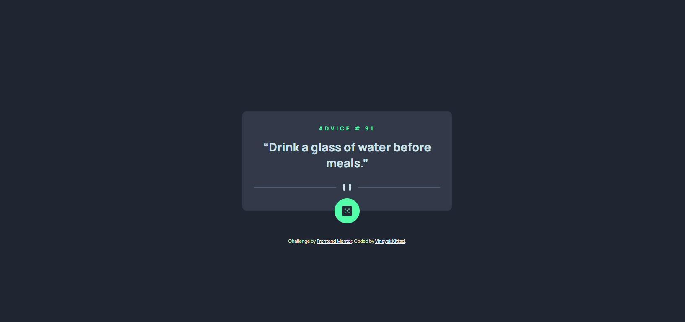
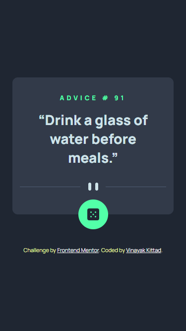
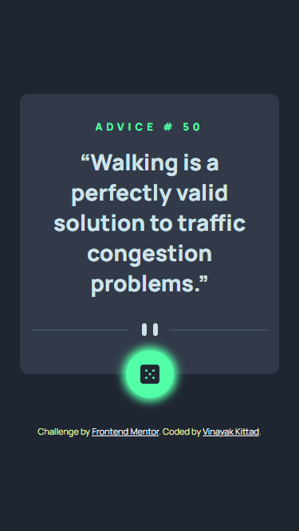

# 🚀 Advice Generator App

## Challenge on Frontend Mentor

### 🌟 Overview

The challenge is to build out an advice generator app using the Advice Slip API and make it look as close to the design provided by Frontend Mentor.

### 🌐 Links

- [🌍 Live Site](https://frontendmentor-challenge1-vinaykittad.netlify.app/)

### 📸 Screenshots

#### 🏠 Desktop

#### 📱 Small Devices

#### ✨ Interactive Elements

### 🔥 The Challenge

Users should be able to:

- View the optimal layout for the app depending on their device's screen size
- See hover states for all interactive elements on the page
- Generate a new piece of advice by clicking the dice icon

### 🛠️ Built with

- Semantic HTML5 markup
- CSS custom properties
- Flexbox

### 🎓 What I Learned/Implemented

- API Fetching
- Use of `:before` for background effects
- Responsive web design
- Problem-solving approach

## 👤 Author

- [GitHub Profile](https://github.com/VINAYAK9669)
- [Frontend Mentor Profile](https://www.frontendmentor.io/solutions/api-fetching-responsive-design-css-for-a-dynamic-user-experience-wy4yydAmii)

---

**Live Demo:** [https://frontendmentor-challenge1-vinaykittad.netlify.app/]
